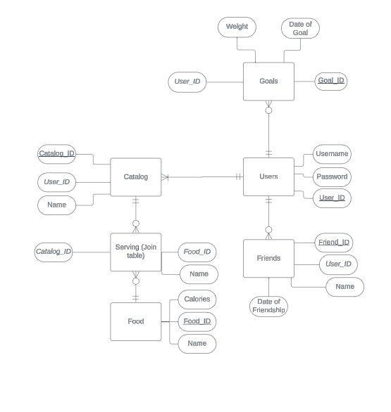

# README

## Contributors
Jack Hoppe
Doby Lanete
Kyle Moore
Ethan Wenthe

## Introduction

Eating is an important part of daily life, and managing what you eat can lead to a healthier, happier, and longer life. However, many people do not understand how calories and different types of food will affect and be processed by the body, leading many to develop nutrient deficiencies which may result in further medical issues. We plan to combat this by creating a web application that will give users the ability to log foods from different diets that work well for them, creating a database of healthy and delicious foods.

## Overview

This will be a web-based application that will allow users to log what foods and diets they enjoy into a single catalog. The system will then enable the user to find healthy and nutritious diets that are customized to fit their preferences and avoid their disgust.

- When trying a new food, users can add it to their catalog.
- Users can edit existing foods within their catalog with their own opinions.
- Users can share their opinion on different foods.
- Users can log their goals and progress of the diet.
- (Stretch Goal) Users can generate a diet plan based on their preferred foods.

  ## Requirements
This code has been run on
- blinker 1.8.2
- certifi @ file:///croot/certifi_1720453481653/work/certifi
- click 8.1.7
- colorama  0.4.6
- Flask  3.0.3
- Flask-Login  0.6.3
- Flask-SQLAlchemy  3.1.1
- greenlet  3.0.3
- itsdangerous  2.2.0
- Jinja2  3.1.4
- MarkupSafe  2.1.5
- psycopg2-binary  2.9.9
- pycryptodome  3.20.0
- SQLAlchemy   2.0.31
- typing_extensions  4.12.2
- Werkzeug  3.0.3

##Installation

Download this repository using git:
git clone https://github.com/Summer24-CSCE-310-Database-Systems/github-setup-nutrinotes.git

##Tests
no tests are implemented for this current MVP

##Execution of Code
- enter a conda terminal
- ensure your in the repostitory directory
- run
  conda env create -f environment.yml
  conda activate nutrinotes
  flask shell
  db.create_all()
   CTRL+C
  flask run

The application can be viewed by navigating to
https://localhost:5000/

##Testing Note
The database will need to be populated, those actions are avalible through the application

# Database Design
 
